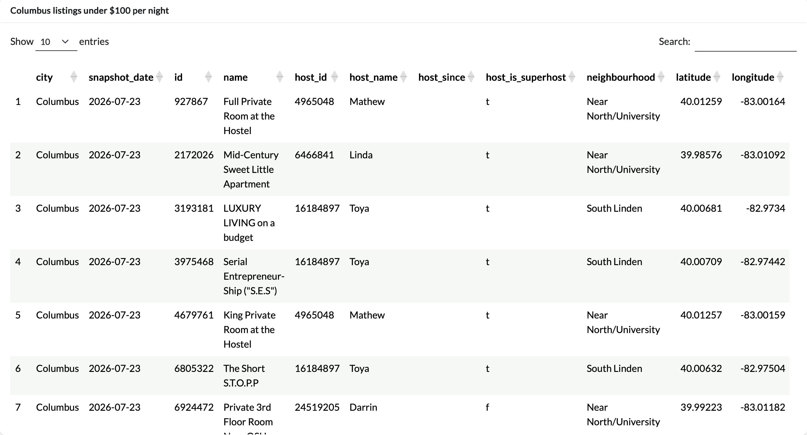
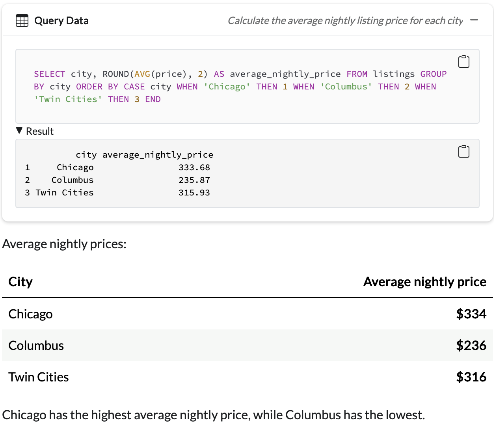
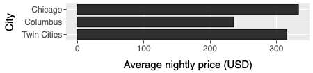

# ISA 401 Midwest Airbnb Chat

**Ask a question in plain English, get the SQL and a table or chart back**

A querychat app built in ISA 401 at Miami University using Airbnb listing data from Chicago, Columbus, and the Twin Cities. The app lets users ask questions about the listings in plain English and returns SQL queries, tables, or visualizations.

**Live app:** https://midwest-airbnb-chat-whd5.onrender.com

### Example Questions

**1. Show me Columbus listings under $100 per night.**



**2. Calculate the average nightly listing price for each city.**



**3. Show the average nightly price for each city as a chart.**



---

## What is this app?

The app connects to a SQLite database (`data/midwest_airbnb.db`), hands the `listings` table to querychat, and lets an LLM translate plain-English questions into SQL. The app can return query results as tables or visualizations, and the SQL panel lets users see the query that was generated.

---

## Dataset Information

**Dataset:** `listings` table in `data/midwest_airbnb.db` (14,887 rows, 29 columns)

**Source:** Inside Airbnb detailed listings data for Chicago, Columbus, and the Twin Cities MSA.

**Data dictionary:** `data/data_desc.md`

**Query rules for the LLM:** `data/extra_instructions.md`

### Key Fields

| Field | Description |
|-------|-------------|
| `city` | Inside Airbnb region: Chicago, Columbus, or Twin Cities |
| `name` | Airbnb listing title |
| `price` | Nightly listing price in U.S. dollars |
| `room_type` | Airbnb room/listing category |
| `neighbourhood` | Neighbourhood where the listing is located |
| `host_is_superhost` | `t` if the host is a Superhost and `f` otherwise |
| `review_scores_rating` | Overall review rating for the listing |
| `availability_365` | Number of days shown as available during the next 365 days |

---

## Required Secret

The app calls OpenAI (`gpt-5.6-luna`, reasoning off) through ellmer, so it requires an environment variable named `OPENAI_API_KEY`.

Never commit your API key to GitHub. On Render, the key is stored as an environment variable for the service.

---

## Running Locally

**With R:**

```r
# from inside apps/midwest_airbnb_chat/
shiny::runApp(".", port = 7860)